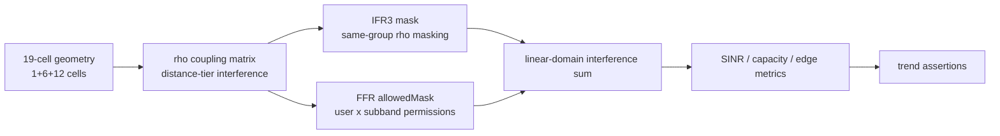

# 5G FFR 仿真复现作品展示

这是一个面向作品集、简历和面试讲解的 5G 分数频率复用（Fractional Frequency Reuse, FFR）公开展示仓库。仓库用 Python 构建可重复的合成数据仿真流程，复刻自主复现所用的 MATLAB 验证管线结构：生成 SNR 与用户密度扫描、比较 IFR3/SWF/FFR 组合策略、验证定性趋势，并输出论文风格图表。

> 公开边界：本仓库包含的是 synthetic/demo 数据和脱敏后的 Python 展示流程，不复制私有 MATLAB 源码，不包含未公开原始实验输出，也不把 demo 结果表述为真实论文数据。

## Related Paper (First-Author Review)

- Paper: [Research on Fractional Frequency Multiplexing Strategies in 5G Networks](https://drpress.org/ojs/index.php/HSET/article/view/28966)

该论文是第一作者综述（review），收录于 CSIC 2024 会议论文集，刊于 Highlights in Science, Engineering and Technology (HSET), Vol. 124, pp. 308-313，DOI: 10.54097/jf1y1p12。论文用于归纳 FFR/DFA 相关研究方向；本仓库对应的私有 MATLAB 项目是对综述所涉文献 19-cell 实验的自主复现；本公开仓库则是该复现流程的 Python 合成数据展示版。

三层关系需要分开理解：综述论文负责归纳 8 篇 FFR/DFA 文献，私有 MATLAB 项目负责复现其中核心 19-cell 策略对比，公开 Python demo 负责展示可复现管线、趋势检查和图表生成流程。仓库中的图表、CSV 和 JSON 输出均由本仓库代码生成，是公开展示用的合成 demo，不等同于论文原始数据或私有 MATLAB 输出。

## English Summary

This repository is a public synthetic-data showcase for a 5G fractional frequency reuse simulation workflow. It demonstrates reproducibility discipline, communication-network reasoning, trend validation, and paper-style figure generation without shipping private source files or unpublished raw experiment data.

## 展示范围

- 主题：5G cellular / heterogeneous network interference mitigation with fractional frequency reuse。
- 方法：`IFR3`、`SWF`、`FFR+IFR3`、`FFR+SWF`。
- 指标：capacity、spectral efficiency、edge capacity、edge SINR、interference index。
- 复现形式：用确定性 Python 流程模拟 MATLAB 风格 alignment workflow。
- 数据边界：所有数据均为 synthetic/demo 数据，仅用于公开作品集展示。

## 图表复现状态

| Figure | Public demo target | Script | Status | Data note |
| --- | --- | --- | --- | --- |
| Fig.3 Capacity vs SNR | Capacity increases with SNR; SWF variants improve total capacity | `python scripts/generate_figures.py` | Implemented | Synthetic/demo data |
| Fig.4 Edge SINR | FFR improves edge SINR under fixed equal-power allocation; FFR+SWF keeps edge SINR close to SWF under hard spectral isolation | `python scripts/generate_figures.py` | Implemented | Synthetic/demo data |
| Capacity vs user density | Capacity/interference changes under denser users | `python scripts/run_paper_alignment.py` | Implemented | Synthetic/demo data |
| Trend verification | Monotonic SNR gain, FFR edge gain, SWF capacity gain | `python scripts/verify_paper_trends.py` | Implemented | Synthetic/demo data |

## Verified reproduction results (private MATLAB)

以下数字来自私有 MATLAB 复现的实测输出（2026-07），非本仓库合成数据。它们用于说明本人复现工作的核实口径，不与公开 demo 图表混作同一数据源。

| Check | Verified result |
| --- | --- |
| Trend configuration | `Nf=12`, `Nsim=3`, `SNR=[0,10,20] dB`, `Um=[6,18]`; three assertions passed |
| Capacity gain from 0 to 20 dB | SWF +110.5, FFR+IFR3 +39.6, FFR+SWF +28.2, IFR3 +25.2 bps/Hz |
| FFR+IFR3 vs IFR3 edge SINR | +13% (0.01061 vs 0.009363) |
| FFR+SWF vs SWF edge SINR | Keeps about 91% of SWF (0.1076 vs 0.1184) |

精确讲法：FFR 对固定等功率分配（IFR3）有明确边缘增益；当功率分配本身已干扰感知（SWF）时，组合的意义是在频谱硬隔离约束下保持接近的边缘性能，而不是把组合策略讲成新的边缘增益来源。

## Architecture notes

私有 MATLAB 复现按“两层正交性”组织：几何耦合先描述小区间距离衰减，同频层再决定哪些小区和用户会在同一子带上互相干扰。



FAQ:

- **SWF 怎么求？** 使用迭代互注水思路，按用户排序计算闭式水位，并用功率变化阈值和最大迭代次数控制收敛。
- **边缘用户怎么判定？** 私有 MATLAB 复现使用用户半径不小于 `cellRadius/4` 的规则。
- **为什么 19-cell 够用？** 中心小区加两圈邻区覆盖主要同频干扰来源，规模又足够可控，适合策略对比。
- **为什么公开仓库用合成数据？** 公开层只展示可复现管线和趋势验证能力，不发布私有 MATLAB 源码或原始实验输出。

## 快速运行

```bash
python -m venv .venv
.venv\Scripts\activate
pip install -e ".[test]"
python scripts/run_paper_alignment.py
python scripts/verify_paper_trends.py
python scripts/generate_figures.py
pytest
```

生成的 CSV、JSON 和 PNG 文件会写入 `outputs/`。

## 仓库结构

```text
src/ffr_showcase/      Synthetic simulation, trend checks, and plotting
scripts/               Command-line entry points
tests/                 Pytest smoke and trend tests
docs/                  Public methodology notes and static demo page
data/                  Data policy and synthetic-data notes
outputs/               Generated local artifacts, kept out of source by default
```

## 为什么使用合成数据？

该仓库面向公开作品集审阅，重点展示仿真设计、复现意识和通信网络推理能力。它不公开私有路径、原始 MATLAB 代码、敏感账号信息或未发布原始材料。

## 趋势检查

`verify_paper_trends.py` 检查：

- 每种方法在中位用户密度下，capacity 随 SNR 增长；
- FFR+IFR3 相比 IFR3 提升 edge-user SINR，FFR+SWF 在硬频谱隔离下保持接近 SWF 的 edge-user SINR；
- 用户密度增加时 interference index 上升；
- SWF 相比对应 IFR3-style baseline 提升 total capacity。
